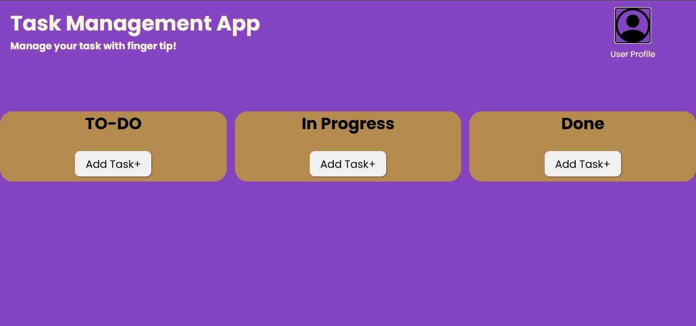
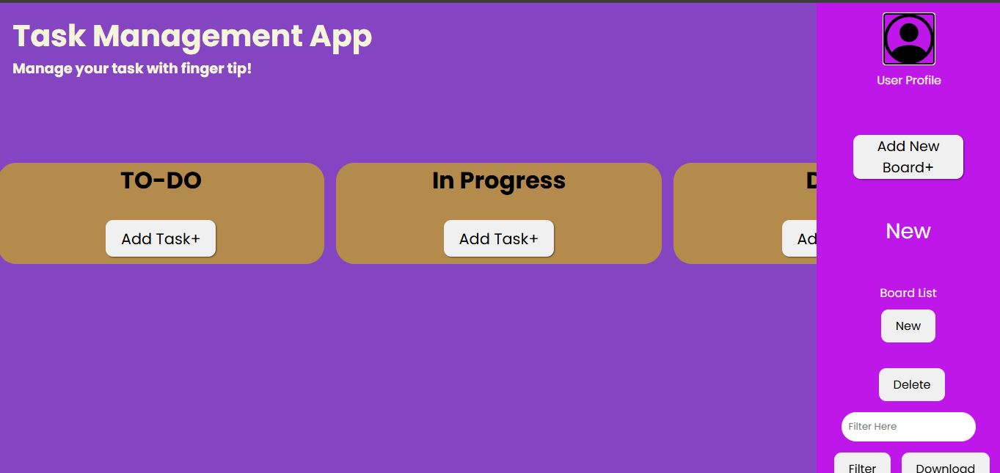

# Task ManageMent App - Manage Your Task With Finger Tip
Fully Customized task management App crated by JavaScript and HTML and responsive UI using CSS.

##features
-> Add Board With Modal.
-> Add Task With Modal.
-> Add Task in 3 Stage ( TO-Do, In Progress, Done)
-> CURD-(Create, Update, Read, Delete).
-> Side Bar.
-> Display board name in sidebar. just click and it will display on board.
-> Delete Board.
-> Filter Board.
-> Undo Board.
-> Download Your Task.

## 🛠 Tech Stack

- HTML
- Vanila.js
- CSS

## Live Demo
Not Available.

## ScreenShot



## Personal Note
Git commit history is not available for this project because it was developed on a low-end system.
Running Git or Git Extensions in VS Code significantly slowed down the editor, often causing it to hang.
As a result, version control was managed manually outside of VS Code for this project.


## 🚀 Run Locally

Clone the project:

```bash
git clone https://github.com/tousher101/Task-Management.git
cd Task-Management

#Then, simply open index.html in your browser.


